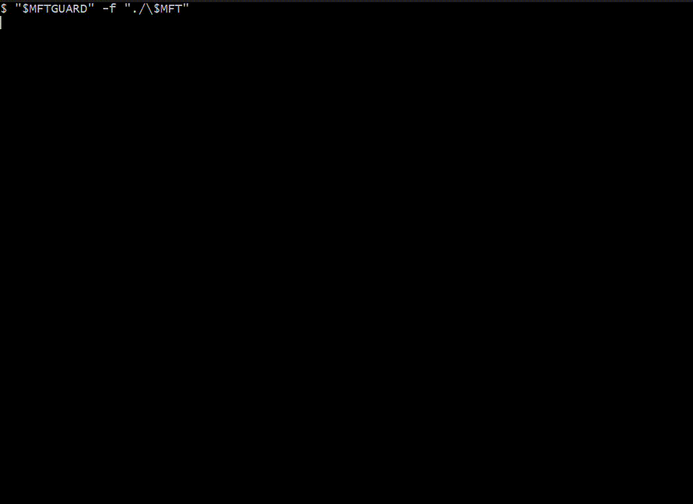

# MFTGuard

## Automated Detection of Potential NTFS Timestamp Manipulation Through $MFT Artifact Analysis

[T1070.006 - Indicator Removal: Timestomp](https://attack.mitre.org/techniques/T1070/006/)

MFTGuard is a cross-platform, C-based DFIR tool designed to identify NTFS Master File Table records exhibiting signs of anomalous timestamp behavior.

To accomplish this, MFTGuard parses an entire $MFT binary, record-by-record. As each record is being read, the various attribute timestamp values are compared against pre-defined rulesets. If a record is flagged as potentially suspect, that candidate record is stored in a hash table for further analysis. A structured JSON report is created that contains records that warrant further investigation as well as detailed statistics.

The goal of this project is not to automatically declare a file as a definite result of timestomping. Instead, MFTGuard is an investigative triage tool: it reduces the number of MFT records an investigator needs to examine and provides structured evidence that can be correlated with independent forensic artifacts. This not only saves time and resources, it also allows investigators to perform much deeper analysis of MFT records that are sure to require it.



## Table of Contents

1. [Installation and Usage](#installation--usage)
    - [Requirements](#requirements)
    - [Build](#build)
    - [Input](#input)
    - [Usage](#usage)
2. [Key Features](#key-features)
3. [Lessons Learned](#lessons-learned)
    - [The MFT Contains Significant Noise](#the-mft-contains-significant-noise)
    - [Correlation Is Essential](#correlation-is-essential)
4. [Disclaimer](#disclaimer)
5. [Libraries](#libraries)
6. [License](#license)

## Installation & Usage

### Requirements

At the moment, only Windows and Linux environments are supported.

The following are required to build MFTGuard from source:
- C compiler with C11 support
- CMake

CMake is used to simplify the process of configuring and generating build files.

### Build

1. Clone the repository
```
git clone https://github.com/natesec/MFTGuard.git
```

2. Create a build directory
```
mkdir build
```

3. Configure the project and build with CMake
```
cd build
cmake ..
cmake --build .
```

The resulting executable will be located in the generated build directory.

### Input

MFTGuard takes a raw $MFT binary file as input. You can extract such a file easily with a tool such as [KAPE](https://www.kroll.com/en/publications/cyber/kroll-artifact-parser-extractor-kape). Once installed, you can use the following command on Windows to extract the $MFT:
```
kape.exe --tsource C: --target "$MFT" --tdest <output-path>
```

The resulting $MFT file can be provided to MFTGuard for analysis.

### Usage

You can use MFTGuard to analyze a raw binary $MFT file with:
```
MFTGuard.exe -f <$mft> [-s <sector-size> -o <output-file>]
```
Or:
```
MFTGuard.exe --file <$mft> [--sector-size <sector-size> --output <output-file>]
```
You can use the `-h` or `--help` options to display the usage menu with examples.

The default Windows sector size is 512. This will be suitable for most Windows machines

After a successful scan, a JSON report file is created with the filename `mftguard_report.json` by default, or whatever filename is specified.

## Key Features

MFTGuard has a few key features that are implemented in the following order:

- **Raw MFT parsing**:
Parses NTFS `$MFT` records directly from binary, validating record structures, signatures, boundaries, and metadata before further analysis.
- **NTFS USA fixup**:
Validates USA and restores values to the tail of the specified sector size in-place before record contents are interpreted.
- **Attribute parsing**:
Walks the attribute list for each record and extracts the `$STANDARD_INFORMATION` and `$FILE_NAME` attributes using little-endian readers.
- **Timestamp analysis**:
Compares corresponding `$SI` and `$FN` attribute timestamp metadata using anomaly detection rules, with results stored efficiently in the form of a bitmask.
- **Statistical analysis**:
Collects MFT, `$FN`, timestamp relationship, and timestamp delta statistics to provide context for detection and threshold finetuning.
- **Candidate management**:
Uses the `uthash` library to store flagged records by MFT record number in a hash table, preserving independent copies of record metadata.
- **Structured JSON reporting**:
Uses the `cJSON` library to generate a report consisting of statistics and flagged record metadata by iterating over the candidate hash table. Candidates are serialized incrementally to limit memory usage.
- **Forensic correlation**:
Produces findings primed for forensic correlation. Independent artifacts such as the USN Journal, `$LogFile`, Prefetch, Amcache, ShimCache, Windows Event Logs are perfect to compare the JSON report findings against. 
- **Performance**:
In testing, MFTGuard was able to processes a Windows 11 `$MFT` file containing 826,880 records, through complete analysis and the JSON report generation, in about 10 seconds.

## Lessons Learned

MFTGuard began with a much more ambitious goal: develop a timestomping detection tool that could identify suspicious timestamp manipulation with a very low false-positive rate using nothing but the $MFT binary by itself. As development progressed and the tool was tested against real MFT data, this proved to be unrealistic.

### The MFT Contains Significant Noise

NTFS metadata naturally contains a large amount of variation. Differences in `$FILE_NAME` and `$STANDARD_INFORMATION` timestamps can occur for many reasons that aren't at all related to malicious timestamp manipulation. Treating individual timestamp discrepancies as evidence of timestomping produced far too many candidates.

To reduce the false-positive rate, I initially explored increasingly restrictive combinations of timestamp relationships and statistical thresholds in an attempt to reduce this noise. Through testing, the estimated false-positive rate was reduced from approximately 22% to 16%. While this represented an improvement in the behavior of the detection rules, it also demonstrated an important limitation: increasingly complex rules applied to the MFT alone could not reliably distinguish malicious manipulation from legitimate filesystem behavior.

Testing against a clean MFT produced the following results initially:

| Detection Condition | Percentage of Records |
|---------------------|-----------------------|
| SI/FN timestamp mismatch | 15.66% |
| Zeroed timestamps | 6.00% |
| Identical timestamps | 11.67% |

Candidate scoring was another attempt to decrease the false-positive rate: performing analysis that required iteration of the hash table with populated candidates. All attempted candidate scoring fell short. While testing a score based on clustered timestamps: 29.96% of all candidates (134,177) were in a cluster of 10,000 or more. Analyzing the parent directory of candidates produced a similar result, although slightly more promising: 978 candidates did not share a parent directory with any other candidate. Overall, the candidate scoring system was not particularly useful and also had a very costly toll when it came to resources and time (both parent directory and timestamp cluster evaluation required iteration).

This changed the direction of the project. Instead of trying to detect timestomping, the tool was redesigned around forensic triage and evidence correlation.

### Correlation Is Essential

The most promising use of MFTGuard is treating the output as a starting point for investigation rather than a standalone detection system. The resulting report provides detailed data that can be correlated with independent forensic artifacts. Sources such as the USN Journal, $LogFile, Prefetch, Amcache, ShimCache, Windows event logs, Sysmon, LNK files, Jump Lists, and application-specific logs can provide additional context about what happened around the timestamps identified by MFTGuard.

The final design philosophy of the project is:
> MFTGuard points the way, independent forensic artifacts reveal what actually happened

The biggest lesson from the project was therefore not how to create a more complicated detection rule set, it was learning where the available evidence stops being sufficient, and designing the tool to work effectively within that limitation.

## Disclaimer

MFTGuard is intended to assist with the analysis of NTFS timestamp behavior. Its output should not be interpreted as definitive proof that timestomping or general timestamp manipulation occurred.

MFTGuard analyzes information contained within the NTFS Master File Table. It may produce false positives due to legitimate filesystem behavior and the inherent complexity of NTFS metadata. Findings should be validated and correlated with independent forensic artifacts and other available evidence before drawing conclusions.

This project is provided for educational, research, and authorized forensic analysis purposes. Only analyze systems, storage media, and forensic images for which you have appropriate authorization. I will make no guarantees regarding the completeness, accuracy, or suitability of MFTGuard for any particular forensic investigation. The tool should not replace established forensic procedures, independent evidence validation, or professional forensic judgment.

## Libraries

MFTGuard uses the following third-party libraries:

1. [uthash](https://github.com/troydhanson/uthash/blob/master/src/uthash.h): for candidate hash table management
2. [cJSON](https://github.com/DaveGamble/cJSON): for report generation

Local copies of the applicable license files are included in the repository under the third_party directory.

## License

Licensed under the [MIT License](/LICENSE).

Third-party dependencies are distributed under their respective licenses.